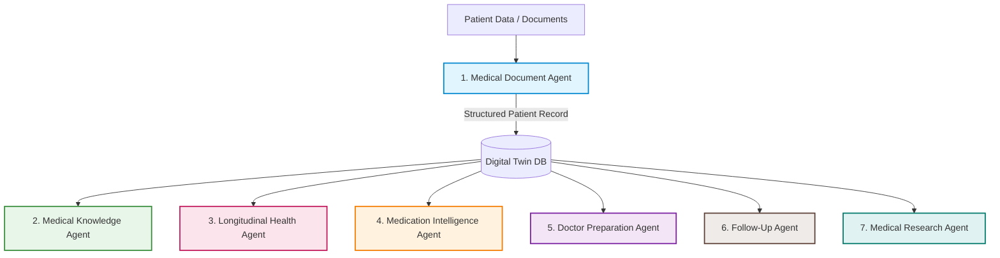

# PulseOS Multi-Agent Architecture

PulseOS is built on a highly modular, multi-agent clinical decision support and patient engagement architecture. Each agent has dedicated responsibilities, inputs, outputs, and clinical tasks.

---

## Agent Overview

---

## 1. Medical Document Agent
Converts unstructured clinical artifacts into a standardized digital twin format.

* **Input:**
  * Blood tests (lab results)
  * Prescriptions
  * Discharge summaries
  * MRI reports & CT scans
  * Doctor/clinical notes
* **Responsibilities:**
  * Optical Character Recognition (OCR) on scans and images
  * Information extraction (extracting entities, values, dates)
  * Standardization of clinical metrics and terminology
* **Output:**
  * Structured Patient Record (JSON digital twin)

---

## 2. Medical Knowledge Agent
Demystifies complex medical terms, lab names, and clinical findings into clear, patient-friendly definitions and actions.

* **Responsibility:**
  * Translates jargon into clear, layperson-understandable terms.
* **Example:**
  * **Input:** `"Elevated ALT"`
  * **Output:** `"ALT is a liver enzyme. Elevated levels can indicate liver inflammation. Discuss with your doctor."`

---

## 3. Longitudinal Health Agent
Tracks clinical metrics over time to identify progressive trends and worsening/improving statuses.

* **Responsibility:**
  * Unlike standard systems that evaluate only the most recent report, this agent contextualizes results over months or years.
* **Example:**
  * **Input History:**
    * `2024: HbA1c = 5.9`
    * `2025: HbA1c = 6.4`
    * `2026: HbA1c = 7.1`
  * **Output:**
    * `"Blood sugar control has progressively worsened."` (Indicating pre-diabetic to diabetic progression).

---

## 4. Medication Intelligence Agent
Maintains patient safety and compliance by analyzing drug schedules and interactions.

* **Responsibility:**
  * Tracks medication schedule adherence.
  * Checks for adverse drug-drug interactions.
  * Screens for therapeutic duplicates and missed dosages.
* **Example:**
  * **Input:** `Aspirin + Ibuprofen`
  * **Output:** `"Potential interaction detected (increased risk of gastrointestinal bleeding)."`

---

## 5. Doctor Preparation Agent
Prepares the patient before their clinical appointments, ensuring high-value discussions with providers.

* **Responsibility:**
  * Generates clinical questions based on patient trajectory and upcoming specialist type.
* **Example:**
  * **Input:** `"Seeing cardiologist tomorrow."`
  * **Output:**
    * **Questions to ask:**
      * *"Why is my LDL cholesterol level increasing?"*
      * *"Should my current cardiovascular medication dosage be adjusted?"*
      * *"Are additional diagnostic tests needed at this stage?"*

---

## 6. Follow-Up Agent
Proactively schedules checks and tests to close the loop on clinical findings.

* **Responsibility:**
  * Automates clinical follow-up planning after a new report is processed.
* **Output:**
  * Recommended follow-up timeline
  * Next tests to discuss with the primary care provider
  * Reminders/scheduling triggers

---

## 7. Medical Research Agent
Acts as an advanced biomedical research assistant (for informational reference, not direct diagnosis).

* **Responsibility:**
  * Gathers verified medical research, guidelines, and trusted sources based on patient health indicators.
* **Example:**
  * **Input:** Report mentioning `Hypertension` and `Fatty liver`.
  * **Output:**
    * Latest clinical guidelines on hypertension and NAFLD
    * Evidence-based lifestyle and dietary recommendations
    * Links to trusted sources (e.g., Mayo Clinic, ACC/AHA guidelines)
