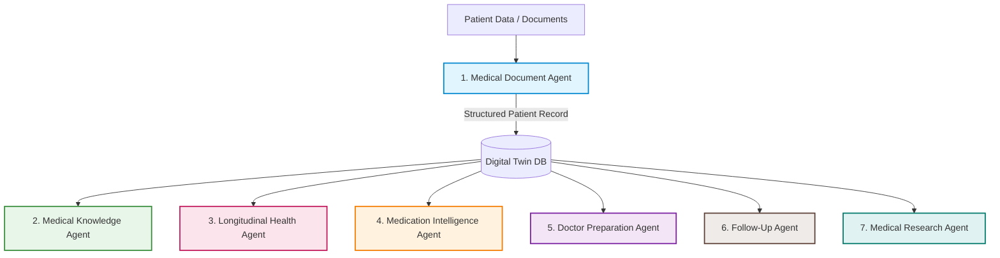

# PulseOS — Clinical Decision Support & Patient Engagement Console

PulseOS is a modern, clinical-intelligence patient platform built on a highly modular multi-agent architecture. It integrates with live NIH RxNorm and PubMed APIs to analyze clinical records, flag medication safety concerns, map anatomical health risks, and prepare patients for primary care visits.

Developed by: **Mohibul Hoque** ([hokworks@gmail.com](mailto:hokworks@gmail.com) | [LinkedIn](https://linkedin.com/in/speedymohibul))

---

## Live Demonstration

The application is deployed and can be accessed online at:
* **Production Live Site**: [https://pulse-os-clinical-intelligence-f3icj7g2z-hok-world.vercel.app]

---

## Multi-Agent Architecture

PulseOS is powered by 7 specialized, cooperative clinical agents that convert unstructured inputs into medical insights:



### Agent Responsibilities

1. **Medical Document Agent**: Automatically parses uploaded clinical files (such as laboratory reports) and converts raw lines into structured medical records (JSON digital twin).
2. **Medical Knowledge Agent**: Translates complex, technical clinical results (e.g., "Elevated ALT") into clear, patient-friendly definitions and warnings.
3. **Longitudinal Health Agent**: Evaluates lab trends chronologically over multi-year records to highlight worsening or improving health trajectories instead of only focusing on the latest result.
4. **Medication Intelligence Agent**: Reviews the patient's current medication list, queries NIH RxNorm APIs to cross-examine drug actions, and checks for dangerous drug-drug interactions or duplicate therapies.
5. **Doctor Preparation Agent**: Helps the patient prepare for upcoming medical visits by generating context-specific clinical questions to discuss with their physician.
6. **Follow-Up Agent**: Recommends appropriate screening timelines, follow-up tests, and preventive health checks based on lab result findings.
7. **Medical Research Agent**: Resolves clinical topics against verified scientific literature databases, querying live PubMed/NCBI APIs for related studies.

---

## Core Features

* **Interactive Organ Anatomy Visualizer**: A custom SVG-based visualizer that highlights organ systems (e.g. liver, kidney, heart, pancreas) and animates a pulsing glow corresponding to detected clinical indicator elevations.
* **Medication Safety Scanning**: Interacts with the National Library of Medicine (NLM) RxNorm database to scan for active drug-drug interactions based on the patient's digital twin medication history.
* **Chronological Health Timeline**: Plots lab metrics over multiple years to visualize patient trajectories.
* **AI Health Assistant Chat**: An interactive chat console powered by the multi-agent system, allowing patients to ask clarifying questions about their lab values, trends, or medications.

---

## System Configuration & Tech Stack

* **Frontend**: React 18, TypeScript, Vite, TailwindCSS (for responsive glassmorphic UI layout), and Lucide React icons.
* **Backend**: FastAPI (Python 3.11+), Google GenAI Agent Development Kit (ADK).
* **Integrations**: NLM RxNorm REST API (Medication interactions), NCBI Entrez Utilities (PubMed research papers).
* **Routing configuration**: `vercel.json` rewrites requests from `/api/(.*)` to the Python Serverless Function (`api/index.py`).

### Environment Variables
* `VITE_API_URL`: Configures the API server endpoint. During local development, this defaults to `http://localhost:8000`. In Vercel production, omitting it or setting it to empty strings defaults to the same-host relative path `/api`, routed automatically by Vercel serverless configurations.

---

## Local Development and Run Instructions

Ensure you have Python 3.11+ and Node.js (v18+) installed on your machine.

### 1. Backend FastAPI Server Setup
1. Open your terminal in the root directory.
2. Create and activate a Python virtual environment:
   ```bash
   python -m venv .venv
   .venv\Scripts\activate
   ```
3. Install the required Python packages:
   ```bash
   pip install -r requirements.txt
   ```
4. Start the FastAPI server:
   ```bash
   python app/server.py
   ```
   *The backend server will run locally at `http://localhost:8000`.*

### 2. Frontend React Client Setup
1. Open a new terminal in the root directory.
2. Install the Node package dependencies:
   ```bash
   npm install
   ```
3. Start the Vite React development server:
   ```bash
   npm run dev
   ```
   *The frontend client will serve locally at `http://localhost:5173`.*

---

## Clinical Data Ingestion

Patients can upload lab results in a CSV format.

### CSV Layout Guidelines
To successfully parse and process custom records, ensure your CSV file includes the headers `metric` and `value` (columns `unit` and `medication` are optional but recommended). Here is a sample format:

```csv
metric,value,unit,medication
ALT,72.0,U/L,Simvastatin 20mg
Creatinine,1.5,mg/dL,Metformin 500mg
LDL,155.0,mg/dL,Lisinopril 10mg
HbA1c,6.4,%,
```

Alternatively, you can test the entire multi-agent dashboard instantly by clicking the **Load Demo Profile** button inside the console.

---

## License

This project is licensed under the [MIT License](LICENSE).
